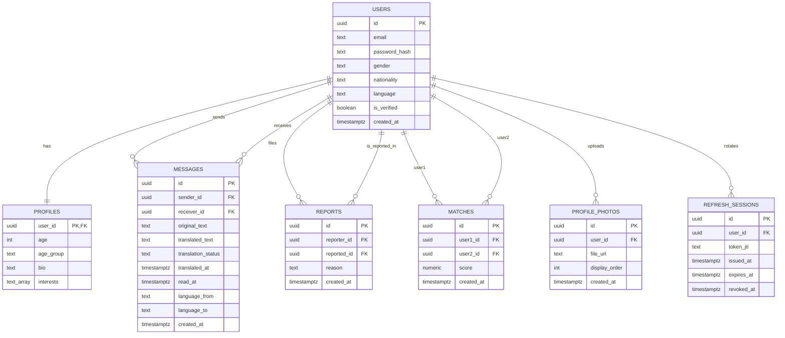

# KR-JP Match Database ERD

## Tables

### users
- Primary key: `id`
- Stores account identity, nationality, language, and verification state

### profiles
- Primary key / foreign key: `user_id -> users.id`
- One-to-one extension table for age, bio, and interests

### matches
- Primary key: `id`
- Foreign keys:
  - `user1_id -> users.id`
  - `user2_id -> users.id`
- Stores one unique user pair and their matching score

### messages
- Primary key: `id`
- Foreign keys:
  - `sender_id -> users.id`
  - `receiver_id -> users.id`
- Stores original and translated chat content

### profile_photos
- Primary key: `id`
- Foreign key:
  - `user_id -> users.id`
- Stores uploaded profile image metadata

### refresh_sessions
- Primary key: `id`
- Foreign key:
  - `user_id -> users.id`
- Stores refresh-token session rotation state

### reports
- Primary key: `id`
- Foreign keys:
  - `reporter_id -> users.id`
  - `reported_id -> users.id`
- Stores user safety reports

## Relationship Summary

- `users 1:1 profiles`
- `users 1:N messages` as sender
- `users 1:N messages` as receiver
- `users 1:N reports` as reporter
- `users 1:N reports` as reported
- `users 1:N profile_photos`
- `users 1:N refresh_sessions`
- `users N:N users` through `matches`

## Mermaid ERD

